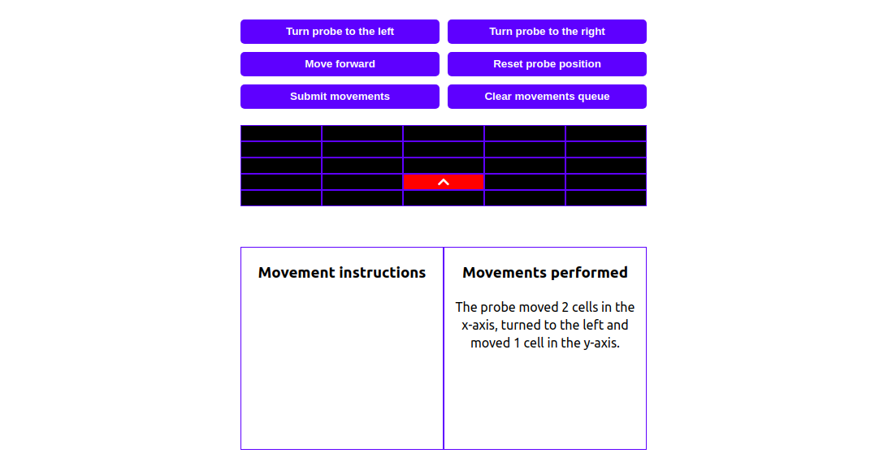
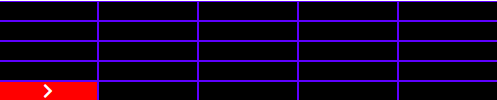

<h1 align="center">Space Probe Movement Control Interface - Credere</h1>
<h2 align="center">

This project was developed as a job test for Credere</h1>

## The App

The app consists of a graphical interface for the control of a space probe landed on Mars. The probe is landed on a 5 x 5 rectangular grid and cannot move over its  bounds. The position of the space probe is represented by a (x,y) coordinate. The probe can face four directions, it rotates only 90ᵒ and moves one  grid cell per movement.

| Movements and Directions | Description |
|--------------------------|-------------|
| D| The probe is facing the 'right' direction.|
| C| The probe is facing the 'up' direction.|
| B| The probe is facing the 'down' direction.|
| E| The probe is facing the 'left' direction.|
| GD| Rotates the probe to the right.|
| GE| Rotates the probe to the left.|
| M| Moves the probe one cell forward.|

The probe has landed at the (0,0) coordinate facing the 'D' direction. 

a search application for starred Github repositories. You can search for an specific Github profile and this app will fetch all starred repositories marked in it. Then, you may create tags for each starred repository and filter your search based on these tags. This app was built with React.js and is responsive, working in desktop, tablet and phone devices. 

The main page of the app consists of an input search bar for Github profiles. 

The user inputs the name of a profile and the app returns all the starred repositories for that search. The user can add, edit and remove tags in each search result, as well as filter the search by tags.

The tags are saved in localStorage, so that the user may refresh or even close the page, and his/her tags will be restored in the next time they visit the app.

## Technologies used
The frontend was built with React.js consuming the Github API (https://api.github.com/users).

The site is live at https://joaoricardotg-brainnco.netlify.app/

## Commands for this app

To install this app, download all the contents of this repository in a specific folder.
Inside of it, run:

### `npm install`

After that, to run the app, run:

### `npm start`

This runs the app in development mode.\
Open [http://localhost:3000](http://localhost:3000) to view it in the browser.

The page will reload if you make edits.\
You will also see any lint errors in the console.

### `npm test`

Runs all the tests. The tests files are present in the 'Functions' folder.
