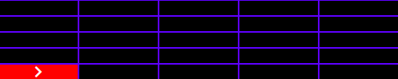

<h1 align="center">Space Probe Movement Control Interface - Credere</h1>
<h2 align="center">

This project was developed as a job test for Credere</h1>

## The App

The app consists of a graphical interface for the control of a space probe landed on Mars. The app controls the position and orientation of the probe, which runs in a backend server and displays the probe data for the user. The probe is landed on a 5 x 5 rectangular grid and cannot move over its  bounds. If the user inputs a sequence of movements for the probe that forces it to move outside of the grid, an error message is returned in the interface, stating that such movement sequence is not permited. The position of the space probe is represented by a (x,y) coordinate. The probe can face four directions, it rotates only 90ᵒ and moves one grid cell per movement, as described by the table below:

| Movements and Directions | Description |
|--------------------------|-------------|
| D| The probe is facing the 'right' direction.|
| C| The probe is facing the 'up' direction.|
| B| The probe is facing the 'down' direction.|
| E| The probe is facing the 'left' direction.|
| GD| Rotates the probe to the right.|
| GE| Rotates the probe to the left.|
| M| Moves the probe one cell forward.|

The control interface for the probe contains 6 buttons, a display for the 5x5 grid and the position and orientation of the probe. Two textfields are displayed, one renders the stack of user inputs for the probe and the other displays the movement performed by the probe. 

## Controller interface

### Buttons

There are 6 buttons in total, three for inserting new orders on the stack of order to be sent to the probe ('turn probe to the left', 'turn probe to the right' and 'move forward'), one to reset the probe position ('reset probe position'), one to send the movements to the probe ('submit movements') and another to clear the stack of movements ('clear movements queue'). The buttons are displayed bellow.

  

### Grid display

The app displays a 5x5 grid. Each cell in the grid represents a possible coordinate for the position of the probe, which is represented by a cell with red background and a white chevron. This last element represents the probe orientation. The image below represents the configuration of the probe the moment it has landed, in position (0,0) facing the right direction.

  

### Text displays

There are two text displays, one for rendering the stack of movements inputed by the user through the input buttons and the other displays a string that describes the movement performed by the probe. For example, if the user has inputed the following sequence - turn left - move forward - move forward - turn probe to the right - move forward, then the first text displays would show:

  

And the result for the probe movement would be displayed in the second text display:

  

The tags are saved in localStorage, so that the user may refresh or even close the page, and his/her tags will be restored in the next time they visit the app.

## Technologies used
The frontend was built with React.js consuming the Github API (https://api.github.com/users).

The site is live at https://joaoricardotg-brainnco.netlify.app/

## Commands for this app

To install this app, download all the contents of this repository in a specific folder.
Inside of it, run:

### `npm install`

After that, to run the app, run:

### `npm start`

This runs the app in development mode.\
Open [http://localhost:3000](http://localhost:3000) to view it in the browser.

The page will reload if you make edits.\
You will also see any lint errors in the console.

### `npm test`

Runs all the tests. The tests files are present in the 'Functions' folder.
